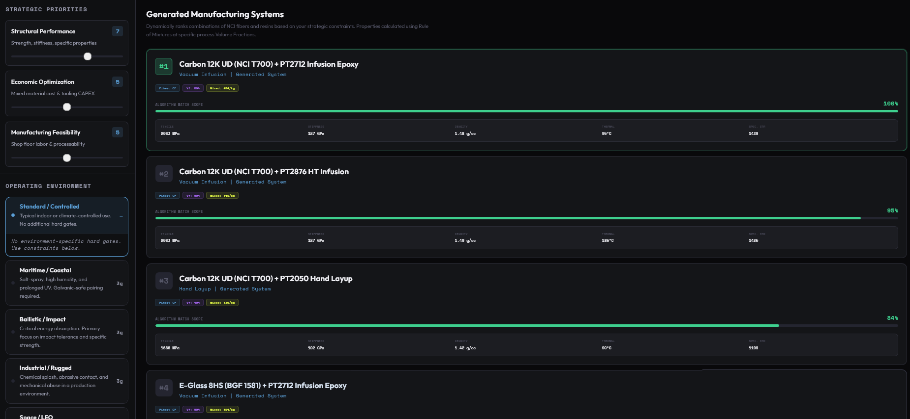
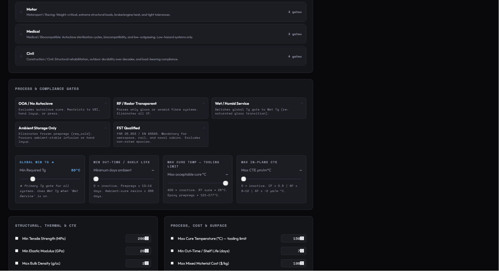
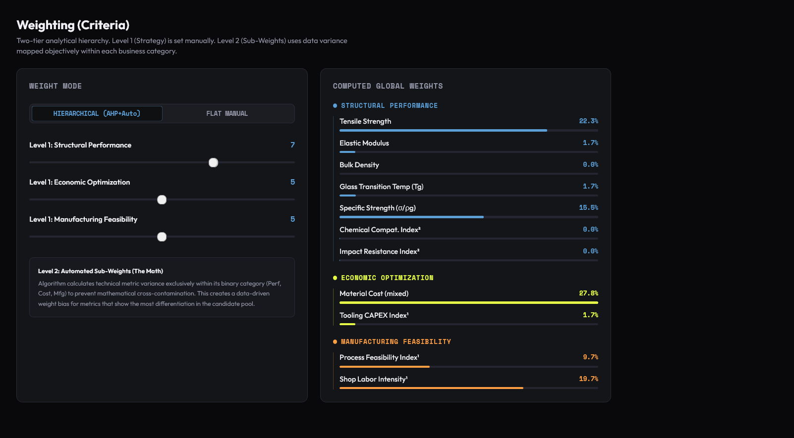
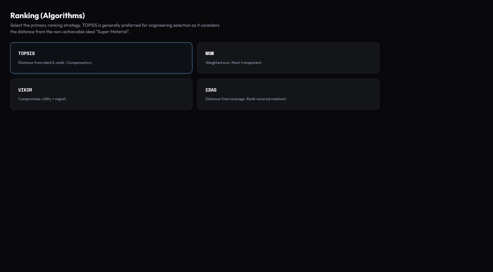
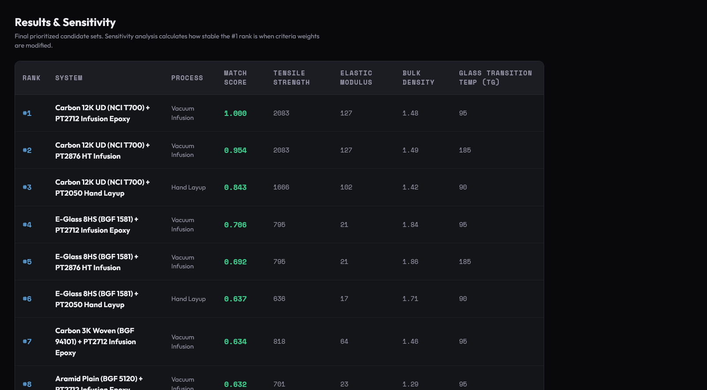
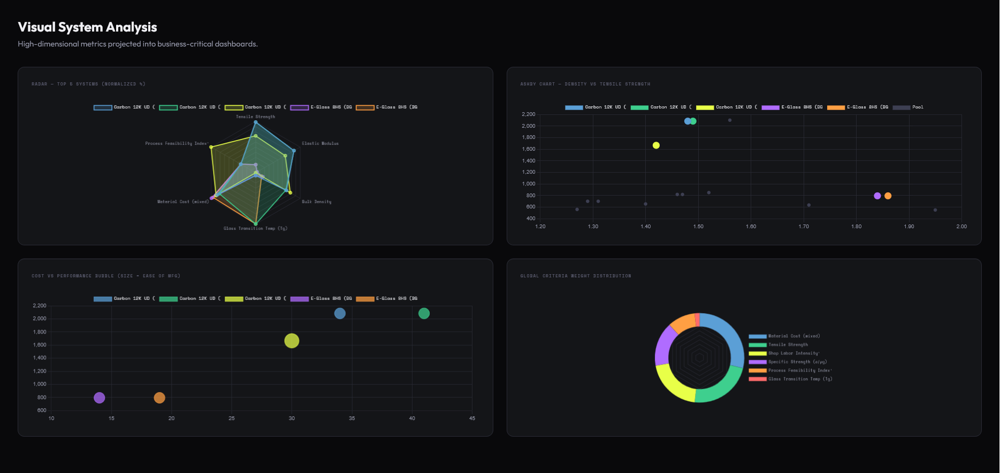

# Dynamic Composites Selection Engine

> A Multi-Criteria Decision Making (MCDM) application that dynamically generates, evaluates, and ranks advanced composite materials based on structural, economic, and manufacturing constraints.

---
## 📸 App Walkthrough

### ⚡ Part 1: The Quick Sale (Sales Enablement)
*Designed for rapid material narrowing, intuitive client presentations, and instant visual justification.*

#### The Sales Dashboard (Quick Selection)

**Slide, Select, and Sell:** An intuitive, high-level interface designed for quick narrowing. Users set broad strategic priorities (Structural Performance, Economic Optimization, Manufacturing Feasibility) and select an operational environment. The engine instantly computes and outputs a dynamically ranked Top 5 list with a percentage Match Score.

---

### 🔬 Part 2: The Deep Dive (Engineering & Expert Mode)
*Designed for structural engineers, technical product managers, and suppliers who require mathematical proof, strict environmental compliance, and data-driven analysis.*

#### Constraints & Hard Gates (Screening)

**Engineering-Grade Elimination:** Before any ranking occurs, materials must pass strict feasibility gates based on application and operating conditions. Users can toggle compliance limits like FST (Fire, Smoke, Toxicity), OOA (Out of Autoclave), maximum tooling cure temperatures, or minimum required wet/dry Tg to eliminate non-viable options early.

#### Criteria Weighting

**Two-Tier Analytical Hierarchy:** The engine uses a hybrid weighting model. Level 1 (Strategic Priorities) is set manually by the user. Level 2 (Sub-Weights) uses data variance mapped objectively (using MEREC/CRITIC methods) to prevent mathematical cross-contamination. This creates a data-driven weight bias for metrics that show the most differentiation in the candidate pool.

#### Ranking Algorithms

**Selectable MCDM Methods:** Evaluates surviving candidates using selectable decision-making algorithms depending on the strictness of the evaluation. Options include **TOPSIS** (compensatory, distance from ideal), **WSM** (transparent weighted sum), **VIKOR** (utility + regret compromise), and **EDAS** (rank-reversal resistant).

#### Results & Sensitivity

**The Final Output:** A clear, prioritized candidate set. The results table displays the final mathematical Match Score alongside critical physical properties. The backend sensitivity analysis calculates how stable the #1 rank is when criteria weights are modified by ±10%.

#### Visual System Analysis

**High-Dimensional Projections:** Translates complex tabular data into business-critical dashboards. Includes normalized Radar charts for top systems, classic Ashby charts (e.g., Density vs. Tensile Strength) for material family clustering, and Cost vs. Performance bubble plots to visually validate the algorithm's #1 choice.

---

## 🎥 App Demonstration

---

## 📖 Overview
**High-Dimensional Projections:** Translates complex tabular data into business-critical dashboards. Includes normalized Radar charts for top systems, classic Ashby charts (e.g., Density vs. Tensile Strength) for material family clustering, and Cost vs. Performance bubble plots to visually validate the algorithm's #1 choice.

### 💡 Value by Role

*   **For Sales Teams ("Slide, Select, Sell"):** Use intuitive sliders to generate visual match percentages. Instantly justify material recommendations and high-performance upsells to clients without diving into complex math.
*   **For Technical Product Managers ("Data-Driven Proof"):** Replace guesswork with algorithmic proof. Set hard environmental gates (e.g., Minimum Tg, FST-fire safety qualifications) and use built-in algorithms (TOPSIS, EDAS) to confidently defend design choices during reviews.
*   **For Suppliers & Distributors ("Benchmarking"):** Benchmark new products against market standards (e.g., proving an optimized infusion system matches an expensive prepreg) or quickly identify viable alternatives for out-of-stock materials.

---

## ⚙️ Under the Hood (How it Works)

*  ### 1. Screening (Hard Gates)
Applies non-negotiable feasibility gates based on the chosen application, required performance, and operating environments (e.g., Space, Maritime, Automotive). If a material cannot survive the temperature, chemical exposure, or FST (Fire, Smoke, Toxicity) requirements, it is eliminated early.

*  ### 2. Weighting (Hybrid Tier Model)
The tool calculates priority weights using a two-tier model:
* **Subjective:** Strategic top-level priorities (Performance vs. Cost) are set manually by the user.
* **Objective:** Sub-criteria weights are derived objectively from the active data pool's variance using **MEREC / CRITIC** methods, preventing criteria with identical scores from skewing the results.

*  ### 3. Ranking (MCDM Algorithms)
The surviving candidates are evaluated and ranked based on their distance from the ideal material solution. The engine supports selectable MCDM algorithms depending on the strictness of the evaluation, including:
* **TOPSIS** (Technique for Order of Preference by Similarity to Ideal Solution)
* **WSM** (Weighted Sum Model)
* **VIKOR** (Vlsekriterijumska Optimizacija I Kompromisno Resenje)
* **EDAS** (Evaluation based on Distance from Average Solution)
---

## 🚧 Current Limitations & Assumptions

*   **The Data Bottleneck:** Extracting and normalizing inconsistent test data from various supplier TDS/SDS PDFs.
*   **Subjective Scaling:** Currently, complex properties like Impact and Chemical Resistance utilize 1–10 comparative indices to simplify the UI math, rather than strict physical test units.
*   **Matrix vs. Fiber Dominated Logic:** The current Rule of Mixtures averages fiber and resin properties linearly, which slightly oversimplifies matrix-dominated traits (like corrosion) and ignores assembly-level interactions (like Carbon Fiber causing galvanic corrosion to aluminum structures).

---

## 🚀 Future Roadmap

- [ ] **Real-World Engineering Units:** Replace the 1–10 subjective scales with strict ASTM/ISO test data (e.g., MPa for Compression After Impact, % retention for Chemical Degradation).
- [ ] **Automated Data Ingestion:** Integrate AI/OCR parsers to automatically read supplier TDS/SDS PDFs and normalize the data directly into the application's database.
- [ ] **Advanced Physics (CLT):** Upgrade the backend from linear Rule of Mixtures to full Classical Laminate Theory (CLT) to simulate specific ply layups (e.g.,[0/90/±45]).
- [ ] **Holistic Assembly Cost Modeling:** Factor secondary operational costs into the Economic score (e.g., Autoclave electricity consumption, cold-storage freezer limits, and required isolation plies for galvanic corrosion).

---

